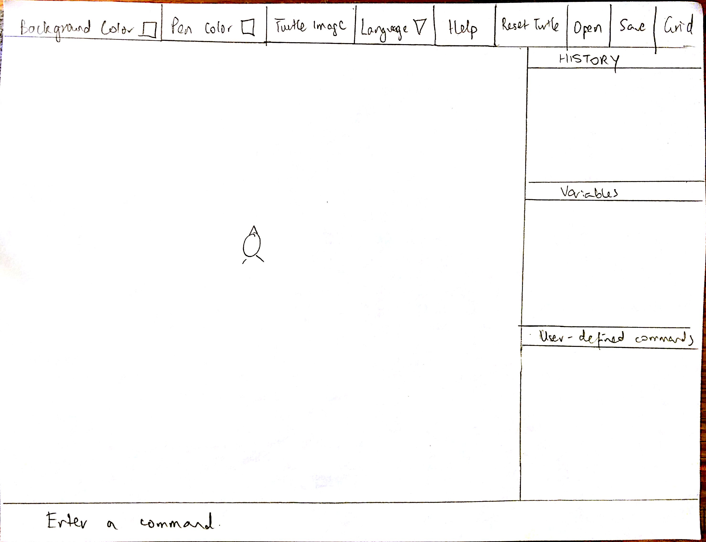
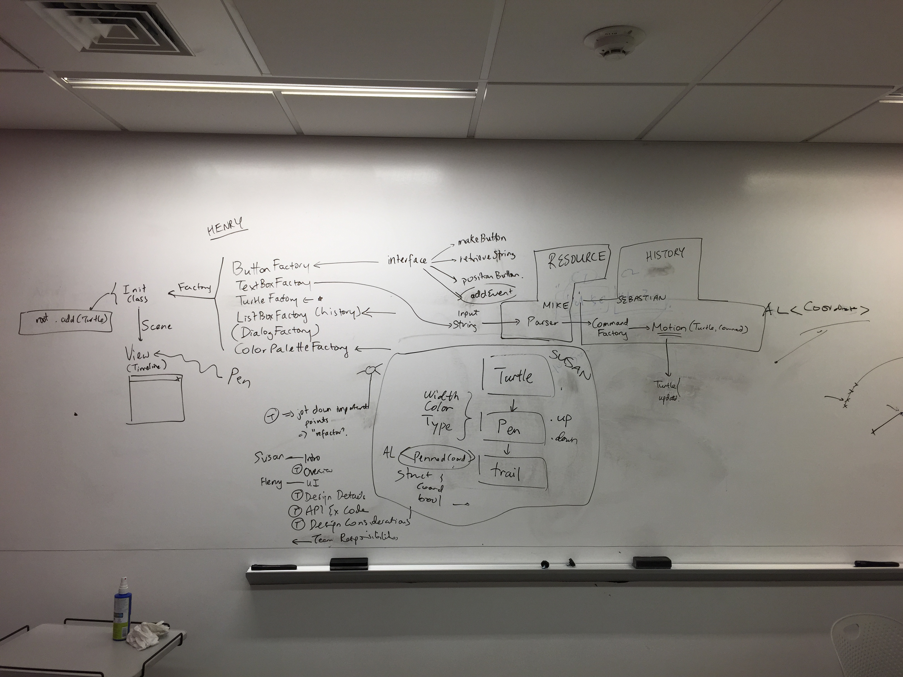

#**Design**

##Introduction

How does a program take in and interpret commands? This is the problem we are trying to solve by building SLogo, a simplified Logo interpreter. The user will interact with the program through the GUI, and using simple commands, be able to move a turtle about the screen. The behavior of these commands will obviously be pretty fixed, but the master list of commands needs to be easily extensible for future programmers. The GUI, too, must be flexible, as both programmers and users will almost certainly want to extend and customize it. The Turtle’s API must be thoughtfully designed to avoid giving other classes too much control, but allow easy extension and new features. There are a great deal of design issues to consider when implementing this program, but our biggest focus, at least right now, is good API among the different parts of the project.

##Overview

In general, the four APIs are GUI classes (frond-end), Turtle related classes (front-end), Parser and Resource File Loader classes (back-end), and Motion classes (back-end). 

The front-end GUI will be divided up into a View-Model structure. All the GUI elements will be created in a Factory pattern and will be initialised in the Init class. The Init class will then pass a Scene to the View, which has the responsibility of displaying the stage. The GUI elements will interact with the backend Model by attaching Event Handlers that call the relevant commands in the backend. The GUI is then refreshed with the latest commands, updated history and turtle position.

The Turtle class really ties together the front and back end. It will represent a turtle and its location, orientation, speed, pen, visibility, and any other necessary information. Each Turtle will have a Pen and a Trail. The Pen class will contain all the variables involved in drawing and visually representing a turtle’s path. The Trail class will use a linked list of Point objects to keep track of the turtle’s and pen’s history through time, so that the path can be drawn.

In the Parser and Resource Loader API, the interpreter takes in string input from the front end and parse it into executable commands. The front end should specify a language to interpret and pass it to the parser together with the string input. Interpreter will encapsulate commands into a command factory object and return this object. Resource file loader takes a string represent language choice. It looks for selected language file in the resource directory and load it. It will return the resource as a map from string to string.

Once the parser class parses the input string into a CommandFactory object (container of the current commands list), the Command objects in CommandFactory are then taken together with the Turtle object into the Motion class. Based on the action string in each Command object, the Motion class decides the corresponding actions needed and updates the position and orientation of the turtle using the instant variables within each Command object. In addition, a History class is needed to store the old commands and can be used to create user-define command later. 

##User Interface
The user interface for the basic implementation will consist of a basic display of the turtle as well as simple options to change pen colour, background colour, languages, etc. To change colours, a colour palette will be used for colour selections. The user will enter commands into the text field that will result in the turtle moving on the display. The commands that are processed will be displayed in the History panel. These commands can be clicked on and reloaded to repeat the pattern on the turtle. If the user enters a bad input (e.g. unrecognizable command) or empty input, a dialog box will appear, notifying the user to check his/her input and to try again. 
 
The UI is also designed for easy extension. Several features that are anticipated include:
- Different workspaces at the same time
- Ability to load and save workspaces

See the screenshot of the UI layout for more details.



##Design Details

###GUI:

There will be individual Factory classes that create specific GUI elements, such as TextFieldFactory and ButtonFactory. Each of the factories will implement an interface to make the object, retrieve the relevant strings from the ResourceBundles and position it on the scene. The interface will also set event handlers for the GUI elements to link them to the backend. There will be several Factories:
* ButtonFactory  
* TextFieldFactory  
* TurtleFactory  
* ListBoxFactory (for History, variable display etc)  
* ColorPaletteFactory  
* DialogFactory  
* WorkSpaceFactory  

These Factory classes are initiated in the Init class and the scene is created with all the elements positioned. In addition, the Factory classes will follow the Singleton design pattern to ensure there is only one Factory created for each of the classes. The Pen and Trail classes are also initialised in this class. The Init class returns the output of type Scene, which is passed to the View class. The View class displays the Scene on the stage, and if required by extensions, also manages the Timeline and KeyFrames. 

In the case of bad/null user input in the text field, a dialog box will pop up, prompting the user to check his/her commands and try again. This will be created by the TextFieldFactory. As a result, there is a dependency of the DialogFactory on the TextFieldFactory, which will have to be initiated before the dialogs are created. 

###Turtle and related classes:

Much of the Turtle class’s API for interacting with the back-end is pretty obvious. It must be able to take commands, so it will have methods like:
* forward(double pixels)   
* backward(double pixels)   
* left(double degrees)  
* right(double degrees)  
* setHeading(double degrees)  
* getHeading()  
* towards(double x, double y)  
* goTo(double x, double y)  
* getX()  
* getY()  
* penUp()  
* penDown()  
* checkPenDown()  
	* setImage(String file)  
	* setVisible(boolean visible)  
* checkVisible()  
	* setVelocity(double velocity) *  
* clear()  

which I believe are all pretty self-explanatory. (* anticipating future extensions) Methods pass the results of these commands to the GUI to be reflected in the display.  

For the sake of modularization and splitting up the work a bit, each Turtle will also be attached to a Pen class. The Pen has parameters that denote its position (up/down), color, weight, style, etc. It has methods like up(), down(), checkDown(), setColor(Color color), setWeight(double weight) *  

Each Turtle also has a Trail. Trail implements a linked list of Point objects. Additionally it has a method called draw() that will iterate through all its Points and draw the necessary lines connecting them (depending on the status of the pen).  

Point represents a moment in time for the turtle - its location, heading, and position of the pen (up/down) when it arrived at this point. The Point class also has a public method distanceFrom(Point point) to compare itself to another point and return the distance between them. This is the return value for a number of basic turtle commands. Point’s public method drawLineFrom(Point point) asks the GUI to draw a line between itself and another point. This will be useful because we will not have to redraw the entire trail every time the turtle moves.  

###Parser and Resource File Loader:  

Interpreter takes in string input from the front end and parse it into executable commands. Its has a default constructor which sets the default language to English. It also has a constructor with one parameter which sets the language used to interpret to the given language. There is one API for interpreter, called parse(). Parse() takes in three variables, the model instance, a string of commands and a string representing the language of the commands. Parse() converts the string input into a list of executable commands. Parse() returns a list of commands.   

Interpreter consists of three parts, Tokenizer, TreeBuilder and Converter. Parse() will sequentially invoke internal APIs from these classes to convert string input into executable commands.  Tokenizer has three internal API called tokenize(), hasNext() and Next(). tokenize() covert a string of input into tokes, and store the tokens as a private variable.  Parameters: a string of input and a set of grammar rules(possibly from file or hard coded). Returns: void. hasNext() is returns a boolean representing whether there are more tokens. Next() returns the next token.  

TreeBuilder has one API called init(). Init() construct a syntax tree.  It takes in a Tokenizer class instance and a resource file (specified by different languages) and returns a syntax tree.  

Converter has one API called convert(). It accepts the root node of the syntax tree, traverse the tree and returns a list of executable commands.  


###Motion:   

The parser class outputs a CommandFactory object, in which all the parsed Command objects are stored. The Command class is the container to store a single command, which looks like below:   
```
Public Class Command {
            	Private String action;
            	Private int value;
		Private Coordinate coord;
Public Command (String action, int value, Coordinate coord) {
                            	this.action = action;
                            	this.value = value;
			this.coord = coord;
}
// getter and setter methods
…
}
```
Then, based on the action string, the corresponding action in the TurtleMotion class will be called. The TurtleMotion class contains all the methods to update the turtle object. To make it flexible for future change, we make TurtleMotion class an interface, and implement all methods and add new methods in the specific motion class. The Motion interface looks like: 
```
Public interface TurtleMotion {
            	Public void translate (Turtle t, Command c);
            	Public void rotate (Turtle t, Command c);
}
```
As translation and rotation are the basic actions of all 2D/3D rigid body , we only include the most general methods in this interface. If later we can confirm that the translate and rotate methods are the same for all turtle simulations, we can then make TurtleMotion an abstract class and instantiate these methods, thus avoiding duplicated code in subclasses. In the subclasses of TurtleMotion, we can add new methods based on the detail specification of the simulation, an example looks like:
```
Public class DrawingTurtleMotion implements TurtleMotion {
            	@override
            	Public void translate (Turtle t, Command c) { }
            	@override
            	Public void rotate (Turtle t, Command c) { }
            	Public void penUp (Turtle t, Command c) { }
            	Public void penDown (Turtle t, Command c) { }
            	…
}
```
The public methods above take in a Turtle object and a Command object, and update the status (i.e., position, orientation, etc.) of the turtle based on the Command object. 

In addition, a History class is needed to store all the commands executed before. The History class will have a structure similar as below:
```
Public class History {
            	List<Command> history;
            	Public History () {
                            	history = new ArrayList<Command> ();
            	}
            	Public void addHistory (Command c) { }
            	Public void removeHistory (Command c) { }
            	Public void clearHistory () { }
            	// getter and setter methods
            	…
}
```


##API Example Code

###GUI: 
```
interface createGUIElement(){
public initElement();
public initOptions();
// Only the following methods will have dependencies on the backend.
// All other API methods are independent of the Model backend. 
public addAction(); // Dependency on Model Commands
public retrieveText(ResourceBundle bundle); // Dependency on Resources
public addText(); // Dependency on Resources
}

public Init{
	// constructor
	private initFactories();
	private newScene();
	public returnScene();
}

public View{
	//constructor
	public setScene();
	*public newTimeline();
	*public update();
	*public newKeyFrame();
}
*These API methods anticipate future extensions.
```
###Parser:
```
public Interpreter{
	public parse();
}
public Tokenizer{
	public tokenize();
	public hasNext();
	public next();
}
public TreeBuilder{
	public init();
}
public Converter{
	public convert();
}
```
When user types “fd 50” in the command text field and click enter, the parser class converts the string into a Command object, with “fd” stored in String action, and 50 stored in int value. Then, since “fd” matches the string value for “forward” in the English.properties in the resource bundle, the translate method in Motion class is called accordingly, which updates the visual variable (ImageView or Shape) in turtle object. 

Within the Turtle class, the method forward(50) will be called, which will calculate the point the Turtle should travel toward and pass those coordinates to its other method goTo(x, y). The Turtle’s location and heading will be updated, and a new Point will be created and added to the Trail. Then with this new Point, we will call drawLineFrom(the last point) to update the turtle’s path by drawing a line on the screen, which is, of course, handled by GUI. (Each point has a variable storing the position of the pen, so drawLineFrom will be sure not to actually draw a line if the pen was up.)

##Design Considerations

GUI: There are some interesting design consideration choices relating to the front-end GUI. The Factory design pattern is useful here as many GUI elements are created, and the implementation of their details should be hidden away. Essentially, the front-end ‘factory production’ process should be kept separate from the display of the elements. As such the Init class bridges this gap. The Init class encapsulates all the details of GUI element production and passes only one object to the View - the Scene. The advantage of this is that all the upstream code from the Init to the View needs not to be changed if the Factory classes are already present. The ‘factory production’ should also be talking to the backend in such a way that no code needs to be changed in the View or the display. In other words, if a new Button needs to be added to change the size of the turtle, the only modification required in the front-end is the addition of a few lines in ButtonFactory - no other changes are required. 

Parser: Each command is an object, but how these command should be structured needs further discussion, especially control commands like “if” and “for”, and customized function. These control commands have the ability to jump to another command (not execute in sequence). So probably a linked list structure is preferable within commands.  

Also, we need to keep in mind that not all commands necessarily creates an action on the turtle, like defining customized function, pen up/down, change turtle image etc.  

Motion: To determine whether a translation or rotation occurs, the Motion class need to know the exact action string for comparing with the resource bundle and determining the specific action needed. Therefore, some code of judging action methods will be needed before calling the methods in Motion class. An alternative is to have an public void update(Turtle t, Command c) in Motion class, which calls the private translation or rotation methods accordingly. In this approach, all motion related code will be included in the Motion class, eliminating the needs for a middle man judging tool. For now, we first stick to the original approach, and will decide whether we need to transfer to the second approach later.   

##Team Responsibilities   

Mike and Sebastian will be tackling the backend API while Susan and Henry will be tackling the front end. Mike will work with creating the resource files and linking this to the relevant front-end elements as well as working on the parser to take in command strings and call the appropriate methods. Sebastian will work with creating the Motion, History and Command classes that are called as a result of the parser output to alter the turtle’s position. Susan will work with creating the Turtle, Pen and Trail class to track where the path that the Turtle has taken. This will interface directly with the front end GUI, which will be created by Henry.